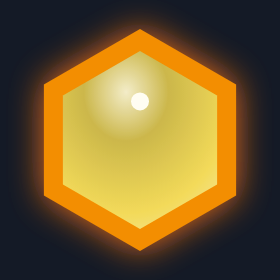
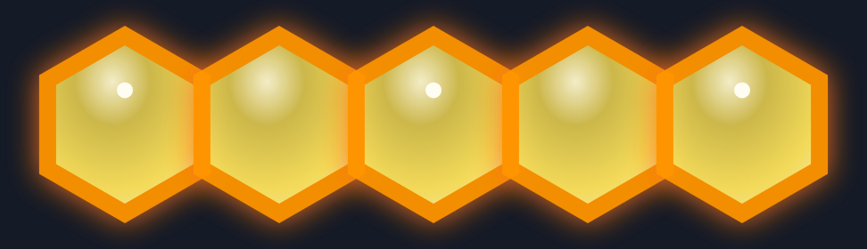

# Handoff: Be the Bee — 벌집(hive) 그래픽 (현행 인게임 룩)

## 이 문서가 뭔가
인스타 캐러셀(`../design_carousel/export/`)에 그려진 **벌집**을, 게임 안에서 실제로 보이는
**현행 벌집 룩**으로 맞추기 위한 사양서다. **Claude Design** 에 넣어 슬라이드의 벌집 일러스트를
이 스펙으로 다시 그리면 된다.

- 지금 캐러셀의 벌집 = **납작한 노랑 육각**(표지의 벌집 클러스터, "벌집" 가르치는 슬라이드의 노랑 줄).
- 게임 실제 벌집 = **입체 밀랍 셀** — 가장자리에 밝은 벽이 솟고, 안쪽은 가운데가 반짝이며 깊게
  패인 꿀, 둘레는 쨍한 금주황 벽, 전체가 따뜻한 주황 글로우로 빛나고, 표면에 흰 빛점이 반짝인다.
- 라이브 룩 확인: https://soomin007.github.io/be-the-bee/ (같은 색 타일 5개를 한 줄로 만들면 벌집)

## 한 줄 요약 (벌집이 무엇으로 보여야 하나)
**"꿀이 고인 밀랍 우물."** 각 칸은 가장자리 벽이 솟고 안에 꿀이 고인 셀이고, 인접한 셀들은
따뜻한 글로우로 이어져 하나의 빛나는 덩어리로 읽힌다.

## 미리보기 (이 문서의 스펙 그대로 렌더한 결과)
| 셀 1개 | 줄 벌집(5칸) |
|---|---|
|  |  |

> 위 두 이미지는 아래 "붙여넣기용 레퍼런스 SVG"를 다크 배경에 그대로 올려 만든 것이다(목표 룩의 정답).
> 빛점은 줄에서 **일부 칸에만** 찍혀 있음에 주목(전 칸에 다 찍지 않는다).

---

## 현재(캐러셀) vs 목표(게임) — 무엇을 바꾸나
| 요소 | 지금 캐러셀(납작) | 목표(게임 실제) |
|---|---|---|
| 채움 | 단순 노랑 라디얼(위 밝음→아래 진함) | **밀랍 우물 라디얼**: 중심 광택 → 깊은 꿀(어두운 링) → 기본 꿀 → 가장자리 밝은 벽 |
| 테두리 | 가는 황토 선 | **두꺼운 금주황 벽**(노랑) / 아주 어두운 갈색 벽(갈색) |
| 빛남 | 없음 | **따뜻한 주황 글로우**(인접 셀을 잇는 drop-shadow) |
| 반짝 | 없음 | **흰 빛점**이 셀 표면 위쪽에 반짝(스틸에선 일부 칸만) |
| 셀 사이 | 맞붙음 | **작은 틈 + 벽 + 글로우** 로 "분리된 솟은 셀"이 한 줄로 이어짐 |

---

## 구성 요소 (z 순서, 아래 → 위)
한 칸의 벌집은 다음을 겹쳐 그린다(정지 이미지 기준):

1. **타일 베이스** — 그 칸의 밑타일(있으면). 벌집은 그 위에 덧그려진다.
2. **꿀 채움** — 밀랍 우물 라디얼 그라데이션(아래 스펙).
3. **진영색 벽** — 두꺼운 stroke(노랑=금주황, 갈색=아주 어두운 갈색).
4. **따뜻한 글로우** — 셀 전체에 주황 drop-shadow. 인접 셀끼리 번져 한 덩어리로 이어진다.
5. **(말)** — 그 칸에 말이 있으면 벌집 위에 얹힌다(말은 별도 핸드오프, 아래 참고).
6. **흰 빛점 반짝** — 맨 위. 셀 표면 위쪽에 작은 흰 점.

---

## 정확한 스펙

### 1) 꿀 채움 — radial gradient
그라데이션 좌표(채움 영역 기준): **cx 42% · cy 26% · r 82%**(빛이 왼쪽 위에서 든 듯 중심이 살짝
위로 치우침). stop 4개:

| offset | 노랑(yellow) | 갈색(brown) | 의미 |
|---|---|---|---|
| 0% | `#fff8d1` | `#eedbc3` | 중심 광택 반사(가장 밝음) |
| 30% | `#d6c04d` | `#a56922` | 깊은 꿀(셀이 패인 어두운 링) |
| 74% | `#ffe55c` | `#c47d28` | 기본 꿀(진영 베이스 색) |
| 100% | `#fff0a0` | `#ddb482` | 가장자리 밝은 밀랍 벽(능선) |

핵심은 **0%(밝음) → 30%(어두움) → 100%(다시 밝음)** 의 명암 반전이다. 이게 "가운데가 깊고
가장자리 벽이 솟은 우물"처럼 보이게 한다. 단순한 위-밝음/아래-어둠 그라데이션이 아니다.

### 2) 벽 (stroke) — 가장 중요
- **노랑 벽 = `#ff9500`(쨍한 금주황).** 원래 황토(`#c27a10`)였는데 갈색 진영 벌집과 헷갈려서
  금주황으로 바꿨다. 캐러셀에서도 **반드시 이 금주황**을 써야 한 눈에 "노랑 벌집"으로 읽힌다.
- **갈색 벽 = `#2e1808`(아주 어두운 갈색).** 갈색 셀 채움과 확실히 구분되게 어둡다.
- 두께: 헥스 반지름의 **약 1/5**(굵게). 셀 칸을 살짝 줄여(아래 배치 참고) 벽이 또렷이 보이게 한다.
- 채움 불투명도 **0.95**.

### 3) 글로우 (셀을 잇는다)
- drop-shadow: **dx 0 · dy 0**, 번짐(stdDeviation) ≈ **헥스 반지름의 0.17배**, 색 `#f97316`
  (따뜻한 주황), 불투명도 1.
- 효과: 셀마다 사방으로 주황빛이 번져 **인접 셀의 글로우가 서로 겹치며 한 덩어리**로 이어진다.
  벌집이 "켜진" 느낌의 핵심이라 정지 이미지에서도 빼지 말 것.

### 4) 빛점 반짝 (hive-spark)
- 작은 **흰 원**(`#fffdf2`), 반지름 ≈ 헥스 반지름의 0.09배.
- 위치: 셀 중심에서 **위로 0.34 × 헥스반지름** 만큼 올린 지점(꿀 표면 위쪽 광택점).
- 게임에선 칸마다 위상을 달리해 물결치듯 깜빡이지만, **정지 캐러셀에선** 줄의 **일부 칸에만**
  또렷한 빛점 1개씩(나머지는 흐리게/생략)을 찍어 "반짝이는 표면"을 암시한다. 모든 칸에 다 찍지 말 것.

### 5) (참고) 동작 — 영상/릴로 만들 때만
- 빛점: 2.2s 주기로 `opacity 0→0.95→0.6→0`, `scale 0.4→1.15→1`. 칸마다 시작 시차를 줘 물결.
- 벌집 완성 순간: 새로 벌집이 된 칸에 바닥부터 꿀이 차오르는 연출(`honey-rise`, 0.7s). 스틸엔 불필요.

---

## 비율 표 (헥스 단위 S 기준 — 캐러셀 헥스 크기에 맞춰 스케일)
게임 기준값은 헥스 외접원 반지름 **S = 30px**. 캐러셀 헥스 크기에 맞춰 아래 비율로 환산하면 된다.

| 항목 | 게임값(S=30) | 비율 |
|---|---|---|
| 셀 폴리곤 반지름 | 26.4 | **0.88 S** (칸을 살짝 줄여 이웃과 틈) |
| 셀 배치 간격(가로 이웃) | 51.96 | **√3 S** (중심 간 거리, 줄이지 않은 풀 피치) |
| 벽 두께(stroke) | 5 | ≈ **0.19 × 셀반지름** (≈ 0.17 S) |
| 글로우 번짐 | 4.5 | ≈ **0.15 S** |
| 빛점 반지름 | 2.4 | ≈ **0.08 S** |
| 빛점 위치(중심 위로) | 10.2 | **0.34 S** |

> 셀은 `0.88 S` 로 줄여 그리되 배치는 `√3 S` 풀 피치로 → 셀 사이 작은 틈이 생기고, 그 틈을 두꺼운
> 벽과 번지는 글로우가 메워 "분리됐지만 이어진" 벌집 줄이 된다.

---

## 헥스 모양
**pointy-top**(위·아래가 뾰족한 육각). 꼭짓점 = 중심에서 60°마다, `-30°` 오프셋. 즉 정상에 한 점,
바닥에 한 점, 좌우로 두 점씩.

---

## 색 토큰 (테마별)
캐러셀은 **다크 배경 + 노랑 벌집**이 주력이므로 기본 테마(honey)의 노랑 값을 쓰면 된다. 단일 출처는
[`../src/ui/themes.ts`](../src/ui/themes.ts)의 `hiveFill` / `hiveStroke` / `hiveGlow`.

| 테마 | 노랑 채움(base) | 노랑 벽 | 갈색 채움(base) | 갈색 벽 | 글로우 |
|---|---|---|---|---|---|
| honey(기본) | `#ffe55c` | `#ff9500` | `#c47d28` | `#2e1808` | `#f97316` |
| 고대비 | `#fff3b0` | `#ff9500` | `#9c6228` | `#1f0f04` | `#ea580c` |
| 벽돌 | `#ffd98a` | `#ff9500` | `#c2532a` | `#3f1407` | `#e2570c` |
| 노랑·남색 | `#ffe55c` | `#ff9500` | `#5276d8`(남색) | `#0c1c4a` | `#facc15` |

> 채움 그라데이션의 4 stop 은 base 색에서 자동 산출된다(위 "꿀 채움" 표 = honey 기준 계산값).
> 다른 테마 base 로 직접 만들려면: 0%=base를 흰색쪽 0.72, 30%=검정쪽 0.16, 74%=base, 100%=흰색쪽 0.42.

---

## 붙여넣기용 레퍼런스 SVG — 노랑 벌집 셀 1개
viewBox 기준 셀 폴리곤 반지름 R=100, 중심 (140,140). 그대로 열어 보고, 캐러셀 헥스 크기로 스케일하면 된다.

```svg
<svg xmlns="http://www.w3.org/2000/svg" viewBox="0 0 280 280" width="280" height="280">
  <defs>
    <radialGradient id="honey-yellow" cx="42%" cy="26%" r="82%">
      <stop offset="0%"   stop-color="#fff8d1"/>
      <stop offset="30%"  stop-color="#d6c04d"/>
      <stop offset="74%"  stop-color="#ffe55c"/>
      <stop offset="100%" stop-color="#fff0a0"/>
    </radialGradient>
    <filter id="hiveGlow" x="-60%" y="-60%" width="220%" height="220%">
      <feDropShadow dx="0" dy="0" stdDeviation="17" flood-color="#f97316" flood-opacity="1"/>
    </filter>
  </defs>
  <!-- 밀랍 우물 셀: 꿀 채움 + 두꺼운 금주황 벽 + 따뜻한 글로우 -->
  <polygon
    points="226.60,90.00 226.60,190.00 140.00,240.00 53.40,190.00 53.40,90.00 140.00,40.00"
    fill="url(#honey-yellow)" stroke="#ff9500" stroke-width="19"
    opacity="0.95" filter="url(#hiveGlow)"/>
  <!-- 표면 광택 빛점(셀 위쪽) -->
  <circle cx="140" cy="101.4" r="9" fill="#fffdf2"/>
</svg>
```

갈색 셀로 바꾸려면: 그라데이션 stop 을 `#eedbc3 / #a56922 / #c47d28 / #ddb482` 로, `stroke` 를
`#2e1808` 로 바꾼다(글로우·빛점은 동일).

### 줄 벌집(5칸) 만들기
같은 셀을 가로로 **√3 R 간격**(R=100이면 ≈ 173)으로 5개 늘어놓으면 한 줄 벌집이 된다. 셀마다 살짝
틈이 있지만 글로우가 번져 이어진다. **줄은 곧게**(꺾이면 벌집이 아니다 — 캐러셀의 "벌집 O / 벌집 X"
대비가 이걸 가르친다).

---

## 어느 슬라이드에 적용하나
- **표지의 벌집(육각) 클러스터** — 납작한 노랑 육각 → 입체 밀랍 셀로.
- **"벌집"을 가르치는 슬라이드의 노랑 줄**(현행 export 의 "벌집 O / 벌집 X" 다이어그램) — 노랑
  줄을 입체 셀로. 단 **곧은 줄(O) vs 꺾인 줄(X)** 의 대비는 그대로 유지.
- 그 외 벌집이 등장하는 장도 동일 룩으로 통일.

> 밀도·구도 규칙(체커보드 금지, 꽉 채우기 금지 등)은 캐러셀 핸드오프
> [`../design_carousel/README.md`](../design_carousel/README.md) ·
> [`../design_handoff_carousel_features/README.md`](../design_handoff_carousel_features/README.md)
> 를 따른다. 이 문서는 **벌집 한 칸이 어떻게 생겼나만** 다룬다.

---

## 파일 / 단일 출처 (코드 기준값)
- 색: [`../src/ui/themes.ts`](../src/ui/themes.ts) — `hiveFill` / `hiveStroke` / `hiveGlow`
- 도형·그라데이션·배치·글로우·빛점: [`../src/ui/game-ui.ts`](../src/ui/game-ui.ts)
  - `applyThemeColors()` 의 `#honey-*` 그라데이션 채움
  - 벌집 셀 렌더 루프(`fill: url(#honey-*)`, `stroke: hiveStroke`, `filter: url(#hiveGlow)`, `size: HEX_SIZE*0.88`)
  - `#hiveGlow` 필터 defs, 빛점(`hive-spark`) 렌더 루프
- 애니메이션: [`../src/style.css`](../src/style.css) — `@keyframes hive-spark`, `@keyframes honey-rise`
- 헥스 좌표/크기: [`../src/ui/layout.ts`](../src/ui/layout.ts) — `HEX_SIZE`, `hexPolygonPoints`(pointy-top)
- **말(꿀벌)은 별도 핸드오프**: [`../design_handoff_bee_pieces/README.md`](../design_handoff_bee_pieces/README.md)

## Fidelity
**Hi-fi.** 색·비율은 모두 코드에서 그대로 뽑은 최종값이다(채움 4 stop 은 `shade()` 로 계산해 검증).
좌표는 헥스 단위(S) 비율로 적었으니 캐러셀의 헥스 크기에 맞춰 스케일만 하면 된다.
